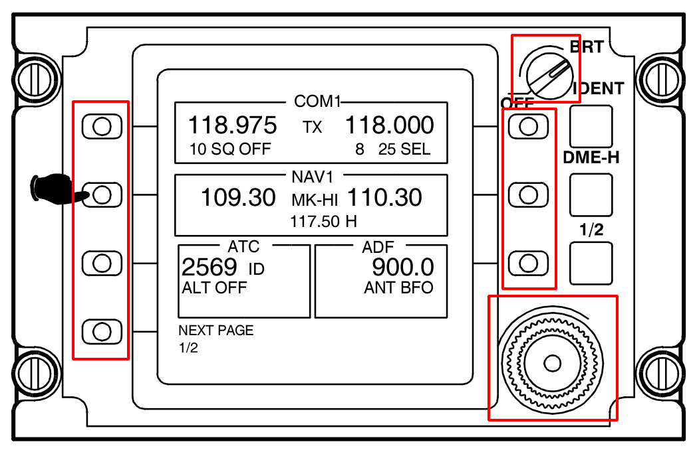

# AW109 RTU's Physical Sensor Controller

Reads AW109 RTU sensor values through Arduino Nano board and send them over
serial interface.



We need to implement controls in red boxes.

## Table of Contents

- [Features](#features)
- [Protocol](#protocol)
- [Schematic](#schematic)
- [Usage](#usage)
- [Author](#author)
- [License](#license)

## Features

- Supports potentiometer, rotary encoder and button with `on_press` and
  `on_release` events

- Optimizes network traffic by sending only changed values

- Simple, read-only, fixed protocol

- Communication over serial interface

- Compatible C++ code with every Arduino board

## Protocol

**Grammar specification**

```
start: message

message : brightness "," inner_rotary "," outer_rotary "," btnsx1 "," btnsx2 "," btnsx3 "," btnsx4 "," btndx1 "," btndx2 "," btndx3 "," a0 "," a2 "," a3 "," a4 "," a5 "," a6 "," a7

brightness: "0" | INT

inner_rotary: rotary_event
outer_rotary: rotary_event

btnsx1: button_event
btnsx2: button_event
btnsx3: button_event
btnsx4: button_event
btndx1: button_event
btndx2: button_event
btndx3: button_event

rotary_event: "-1" | "0" | "1"
button_event: "-1" | "0" | "1"

a0: INT
a2: INT
a3: INT
a4: INT
a5: INT
a6: INT
a7: INT

%import common.INT
```

(Using [Lark grammar specification](https://lark-parser.readthedocs.io/en/latest/grammar.html))

**Example**

```
...

961,-1,0,0,1,0,0,0,0,0
961,0,0,0,0,0,0,0,0,0
961,0,0,0,-1,0,0,0,0,0
547,0,0,0,0,0,0,0,0,0
0,0,0,0,0,0,0,0,0,0
0,-1,0,0,0,0,0,0,0,0
0,-1,0,0,0,0,0,0,0,0
0,-1,0,0,0,0,0,0,0,0
0,0,0,0,0,0,1,1,0,0

...
```

Or, refer to [protocol.py](protocol.py) for a demo. Remember to run
`pip install lark --upgrade` to install lark package.

## Schematic

- A1: potentiometer
- D2: button sx 1
- D3: button sx 2
- D4: button sx 3
- D5: button sx 4
- D6: button dx 1
- D7: button dx 2
- D8: button dx 3
- D9, D10: inner rotary
- D11, D12: outer rotary

## Usage

### With PlatformIO

1. Install [PlatformIO](https://platformio.org/)

2. Connect your Arduino Nano board to your computer (or any other arduino board,
   in this case you may edit `platformio.ini` file and add envornment for your
   board)

3. Run `pio run -t upload,monitor`

## Author

Luca Parolari

- Email: [luca.parolari23@gmail.com](mailto:luca.parolari23@gmail.com)
- GitHub: [@lparolari](https://github.com/lparolari)
- Telegram: [@lparolari](https://t.me/lparolari)

## License

Proprietary

You CANNOT copy, edit or distribute this propgram. If you have questions or you
want to use this program please contact me at
[luca.parolari23@gmail.com](mailto:luca.parolari23@gmail.com).
